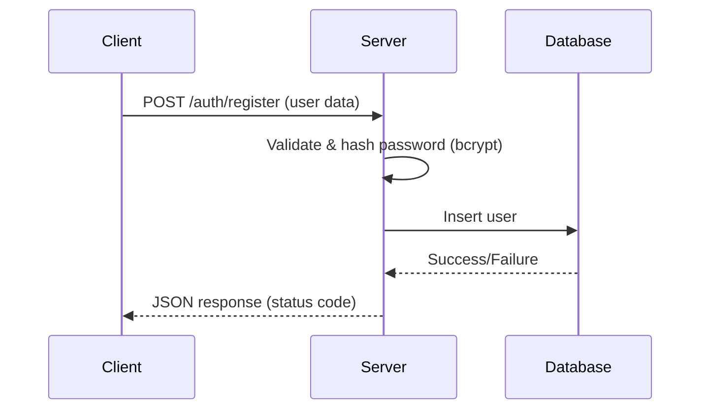

# Todo API

A simple Node.js (Express) API for managing users and todos.

---

## 📦 Features

- User registration with password hashing (bcrypt)
- CRUD operations for todos
- RESTful API design
- Middleware usage for JSON parsing and error handling

---

## 📚 How Requests and Responses Work

When a client (like Postman, VS Code REST Client, or a frontend app) sends an HTTP request to the server, the server processes the request, performs the necessary logic (like saving data or fetching from the database), and sends back an HTTP response.

### Example: Create a User

**Request:**

```http
POST /auth/register
Content-Type: application/json

{
  "firstName": "Sam",
  "lastName": "Mwai",
  "email": "sam@example.com",
  "password": "mypassword123"
}
```

**Response:**

```json
{
  "message": "User created successfully"
}
```

---

### Example: Create a Todo

**Request:**

```http
POST /todo
Content-Type: application/json

{
  "todoName": "Study Node.js",
  "description": "Complete the Node.js course",
  "userId": 2,
  "dueDate": "2025-09-01",
  "isCompleted": false
}
```

**Response:**

```json
{
  "message": "Todo created",
  "todo": {
    "todoName": "Study Node.js",
    "description": "Complete the Node.js course",
    "userId": 2,
    "dueDate": "2025-09-01",
    "isCompleted": false
  }
}
```

---

## 🔢 Common HTTP Status Codes

| Code | Meaning               | Description                    |
| ---- | --------------------- | ------------------------------ |
| 200  | OK                    | Request succeeded              |
| 201  | Created               | Resource created successfully  |
| 400  | Bad Request           | Invalid input or missing data  |
| 401  | Unauthorized          | Authentication required/failed |
| 404  | Not Found             | Resource not found             |
| 500  | Internal Server Error | Server encountered an error    |

---

## 🛡️ Middlewares in Express

**Middleware** functions are functions that have access to the request and response objects, and the next function in the request-response cycle.

**Common uses:**

- Parsing JSON (`express.json()`)
- Logging requests
- Handling errors
- Authentication

**Example:**

```typescript
app.use(express.json()); // Parses incoming JSON requests
```

---

## 🔒 Password Hashing with bcrypt

[bcrypt](https://www.npmjs.com/package/bcryptjs) is a library used to hash passwords before storing them in the database, making it much harder for attackers to retrieve the original password if the database is compromised.

**How it works:**

- When a user registers, their password is hashed using bcrypt.
- The hashed password is stored in the database.
- When logging in, bcrypt compares the provided password with the stored hash.

**Example:**

```typescript
import bcrypt from 'bcryptjs';

const hashedPassword = bcrypt.hashSync(password, 10);
```

---

## 🗺️ API Request-Response Flow Diagram



---

## 🚀 Getting Started

1. Install dependencies:

   ```sh
   pnpm install
   ```
2. Start the server:

   ```sh
   pnpm run dev
   ```
3. Use the provided `.http` file or Postman to test the API.

---
